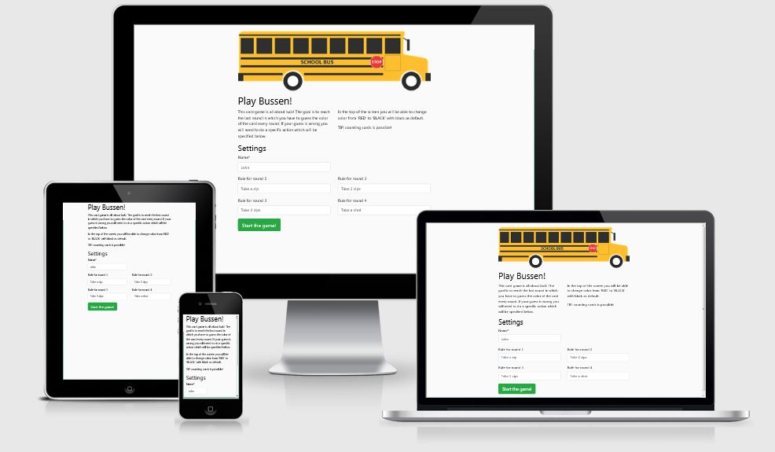

# Bussen

This website is my second milestone project about Interactive Frontend Development at Code Institute.
I've had a long brainstorm session about what to create for this project and decided to build a card game I sometimes play with friends.
The game is all about luck with a 50/50 win ratio per round where there are four rounds in total.
My main goal is to make the game realistic so that you actually have a pack of cards where the program is the dealer.
In this way it is possible to count cards and beat the game the deeper you get in untill the deck is empty and needs to be reshuffled.

Hosted on [GitHub Pages](https://albastraoz.github.io/Bussen/index.html)
Repository on [GitHub](https://github.com/Albastraoz/Bussen)

## UX



### Users 
Expected users of the website are people who want to play an easy card game but have no card deck available.

### User Stories
1. You are at someones party and like to play a quick game of Bussen with some friends
2. Friends travelling who wish to play a card game at an overnight stop
3. Just arrived at the hotel with some friends but no card deck available
4. Travelling with public transport and you try to speed up the time
5. Waiting for your doctors appointment and wondering how many times you can win

### Design
On larger screens You will find a picture of a schoolbus because the game is about riding the buss and trying to get off.
.

For fonts I tried to give it a look with rectangular shapes to fit the game.
- Fonts:
    - Titles: font-family: 'Bebas Neue', cursive;
    - Text: font-family: 'Ubuntu', sans-serif;

Colors and backgrounds are customizable by the user with a default setting, with an exception to the introduction screen.
I've chosen to let the user decide the colors so that the application is more interactive which is the main goal of this project.
- For a neutral but modern look the introduction page has a background of  `#B3B3B3`
- Color schemes: 
    - *default* Dark: text-color  `#FAFAFA`, background-color  `#000000`
    - Light: text-color  `#000000`, background-color  `#FAFAFA`
    - Green: text-color  `#000000`, background-color  `#52C230`
    - Orange: text-color  `#000000`, background-color  `#E45B00`
- Backgrounds:
    - *default* [Green card table texture](https://github.com/Albastraoz/bussen/blob/master/assets/images/background_texture_green.jpg).
    - [Red card table texture](https://github.com/Albastraoz/bussen/blob/master/assets/images/background_texture_red.jpg).

### Mockups
The base idea gave me a good impression on how the game itself should look like but the end result is totaly different:
- [Base idea](https://www.figma.com/file/IqxdhRftZWzAbtFfFlGQ8s/Bussen?node-id=0%3A1)  

## Features

Features planned, implemented and outlined for later development 

### Planned Features
- Documentation - ReadMe File & Mockups
- Working Card Game
- Realistic Game Mechanics
- Colour Schemes
- Custom Backgrounds
- Customizable Card
- Statistical Information
- Personal Stats By Player
- Bootstrap - HTML, CSS Framework
    - Grid System - Columns and Rows
- Responsive design - Mobile First
- UX elements
    - User Flow
    - Animations
    - Transitions
- Accesibility
- Git - Version Control System
- GitHub - Remote Repository
- Deployed - Hosted on Github Pages

### Existing Features
- Documentation - ReadMe File & Mockups
- Working Card Game
- Realistic Game Mechanics
- Colour Schemes
- Custom Backgrounds
- Statistical Information
- Bootstrap - HTML, CSS Framework
    - Grid System - Columns and Rows
- Responsive design - Mobile First
- UX elements
    - User Flow
    - Animations
    - Transitions
- Accesibility
- Git - Version Control System
- GitHub - Remote Repository
- Deployed - Hosted on Github Pages

### Features Left to Implement
- Personal Stats By Player
- Wider Variation Of Color Schemes
- Wider Variation Of Backgrounds
- Customizable Card

## Technologies Used

This project makes use of:
- [HTML](https://developer.mozilla.org/en-US/docs/Web/HTML)
    - HTML for basic strucutre
- [CSS](https://developer.mozilla.org/en-US/docs/Web/CSS)
    - CSS for Styling
- [Bootstrap](https://getbootstrap.com/)
    - HTML and CSS Framework from **Bootstrap**
- [Javascript](https://www.w3schools.com/jsref/)
    - JavaScript for game application
- [jQuery](https://jquery.com/)
    - The project uses JQuery to simplify DOM manipulation
- [Visual Studio Code](https://code.visualstudio.com/)
    - Changed to local workspace where I used VS Code as editor
- [Google Chrome](https://www.google.com/chrome/)
    - Used for browser and dev tools
- [Mozilla Firefox](https://www.mozilla.org/en-US/firefox/new)
    - Used for browser and dev tools
- [Safari](https://www.apple.com/safari/)
    - Used for test purpose
- [Internet Explorer 11](https://www.microsoft.com/en-us/download/details.aspx?id=41628)
    - Used for test purpose
- [Google](https://www.google.com/)
    - **Google** was used for research.
- [Git](https://git-scm.com/)
    - **Git** used for Version Control
- [GitHub](https://github.com/)
    - Repository hosted on **GitHub**
- [Github Pages](https://albastraoz.github.io/Bussen/index.html)
    - Website hosted on **Github Pages**
- [Am I Responsive](http://ami.responsivedesign.is)
    - Testing responsiveness of the website

## Testing

The website was tested by users regularly and for errors on W3.
Most bugs and errors came up on mobile IOS devices and have all been addressed.

### User experience testing 
Preview was send regularly to people within my social circle and asked for testing.

1. Sending website location to specific users over messaging.
2. Collecting feedback.
3. Address and find possible solutions.
4. Test if solutions fix the specific problem and implement the solution.

Testing has been done on the following mobile devices:
- Samsung S9+
- Samsung S7
- Oneplus 7 Pro
- Iphone 11
- Iphone 6
- Iphone SE
- Ipad Pro

Testing has been done in the following browsers:
- Safari (mobile)
- Mozilla Firefox (desktop)
- Google Chrome (desktop and mobile)
- Internet Explorer 11 (desktop)

### Coding error testing
After complete product start to addres coding errors:

1. Go to W3's validation websites [HTML](https://validator.w3.org) or [CSS](https://jigsaw.w3.org/css-validator/).
2. Fill in URL of every specific page and look for errors.
3. Locate errors and solve accordingly.
4. After all errors are solved go back to step 1 and continue untill no errors are shown.

## Deployment

The project is hosted on [GitHub Pages](https://albastraoz.github.io/Bussen/index.html)

The process involved:
- Host a git repository on GitHub. Explained [here](https://help.github.com/en/articles/create-a-repo).
- The root folder contains README.md and index.html files
- On GitHub repository settings page move to GitHub Pages section
- Change source to master branch. (Or any desired branch)
- Provided link will be your projects home (index) page.
 
To deploy your own version of the website:
- Have git installed
- Visit the [repository]([GitHub](https://github.com/Albastraoz/Bussen))
- Click 'Clone or download' and copy the code for http
- Open your chosen IDE (Cloud9, VS Code, etc.)
- Open a terminal in your root directory
- Type 'git clone ' followed by the code taken from github repository
    - ```git clone https://github.com/Albastraoz/bussen.git```
- When this completes you have your own version of the website
    - Feel free to make any changes to it
- The website can be run by opening one of the HTML files within a web browser
- Visit the link provided
- Your website with any made changes will appear
- Saved changes to the website will appear here after refreshing the page

The benefits of hosting your website on GitHub pages is that any pushed changes to your project will automatically update the website. Development branches can be created and merged to the master when complete.

It may take a moment for changes to appear on the hosted website.

## Credits

### Content
Fonts are imported from Google fonts:
- [Google Fonts](https://fonts.google.com/)

### Media
All media is edited by myself in order to fit the website.
The images for the website are copyright free and taken from:
- [Wikipedia](https://www.wikipedia.org/)
- [Needpix](https://www.needpix.com/)

All images direct location:
- [background_texture_green.jpg](https://www.needpix.com/photo/1549611/dice-felt-green-casino-gambling-game-gaming-publicdomain-wallpaper)
- [background_texture_red.jpg](https://commons.wikimedia.org/wiki/File:Whist-type_trick.jpg)
- [schoolbus.png](https://www.needpix.com/photo/669292/schoolbus-school-education-vehicle-transportation-bus-school-bus)
- [All vector playing cards](https://commons.wikimedia.org/wiki/File:English_pattern_playing_cards_deck.svg)
- [card_cover_default.png](https://commons.wikimedia.org/wiki/File:Reverso_baraja_espa%C3%B1ola.svg)

### Acknowledgements
Thank you to the following for inspiration, motivation and the direction I needed:

- Seun Owonikoko    @seun_mentor
- Aart Kaal         *Testing application*
- Monique Kroon     *Testing application*
- Yung-Chin Huang   *Testing application*
- Code Institute
- Google - your best friend
